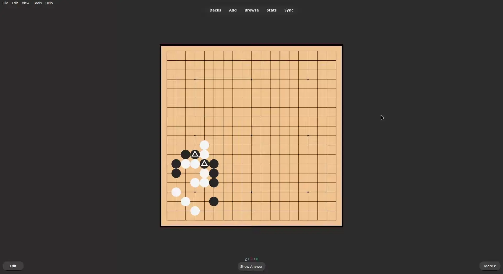

# go
 A Go/Baduk template for Anki

## Features

- Works with SGF format
- Works offline and on Ankidroid (Ankidroid verified, IOS probably)
- No addons required
- Analysis board on the backside
- Backside border colour to indicate mistakes

You're now ready to install:

1. Go to the **[_Releases_ page](https://github.com/TowelSniffer/go/releases)**.
1. In the latest release's _Assets_ section, download "go.apkg".
1. Open Anki and make sure your devices are all synchronized.
1. In the _File_ menu, select _Import_.
1. Browse for and select the downloaded file `go.apkg`.
1. Download the Media Files.rar folder and extract. Copy the contents of the Media Files folder into you anki collection.media folder

👉 To stay informed of new releases, make sure to [watch this repository's releases](https://help.github.com/en/articles/watching-and-unwatching-releases-for-a-repository).

## Customization

### First move of puzzle

there is a line near the top of the front template: `var goFirst = false;`. Changing that value to true will make the template start from the first move rather than the second. The issue is it will always show the first move as black, and I wasn't able to fix this. I prefer to design cards where you can see the last move the opponent made anyway and it was the easiest way to deal with a lot of issues relating to this (such as indicating who's move it is on touch screen devices).

### enable random variations on all problems

'var randVar = true` setting this value to true/false will detirmine whether the SGF puzzles have randomized orientations and colours. Thanks trdischat for this feature.

### Including incorrect lines in SGF

by adding a comment in your SGF solution that begins with "INCORRECT", "WRONG" or "FAIL" (case insensitive), the template will record this line as wrong while still allowing you to play it. Thanks trdischat for this feature.

Note: another issue setting this option is if you flip the cards too fast, sometimes the first move will autoplay. This is due to some weirdness with a timeout funtion that I cant seem to fix. modifying the timeout `var myTimeout = setTimeout(nextMove, 200);` by lowering 200 to something like 50 should work, unless you are super fast at flipping (there are three instances to change on the front side and one on the back).

## Upgrading

The upgrade process is typically the same as the installation process explained in the [previous section](#getting-started). However, some situations require extra care. As a general rule, **always read the release notes carefully**; they will likely tell you what to do or point you to a page that does.

## resources used For this were:

#### this uses a slightly modified besgo for the viewer
https://yewang.github.io/besogo/
